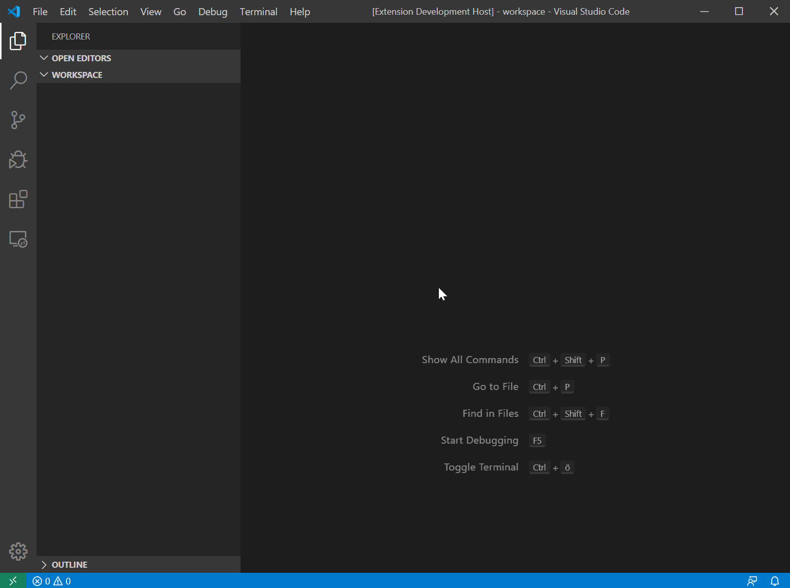

# Status Bar Parameter

This vscode extension adds selectable parameter to the status bar (in the bottom), which then can be used in tasks.json or .code-workspace files.

## Features

* Add a parameter by using the command: `StatusBarParam: Add Parameter to Status Bar`.
* Select an argument by clicking on the status bar item.
* Retrieve the selected value in commands of tasks.json with `${input:<param_name>}`.
* Edit/Delete the entry at the input section of the .vscode/tasks.json to adjust/remove the parameter in the status bar

> Tip: You can also get the selected value in other tasks.json's or wherever vscode supports the substitution of commands. Just use `${command:statusBarParam.get.<param_name>}` instead of the mentioned 'input' syntax above.

## Known Issues

* None yet.