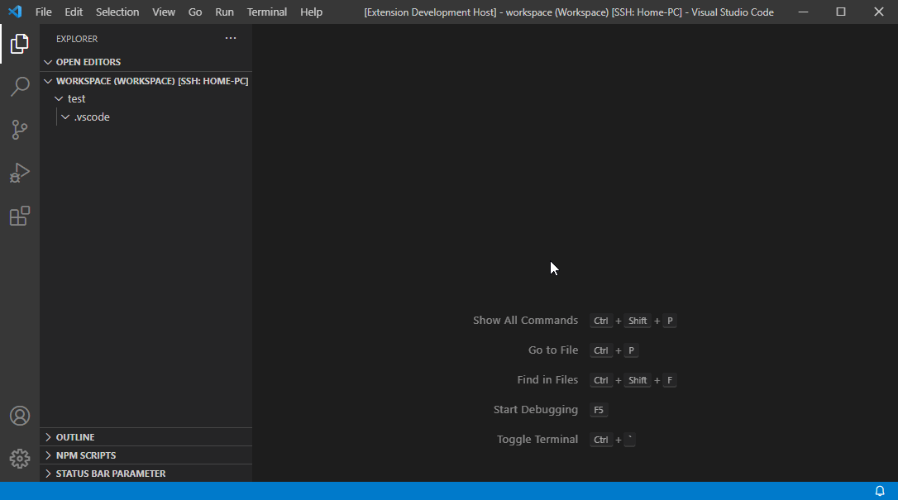
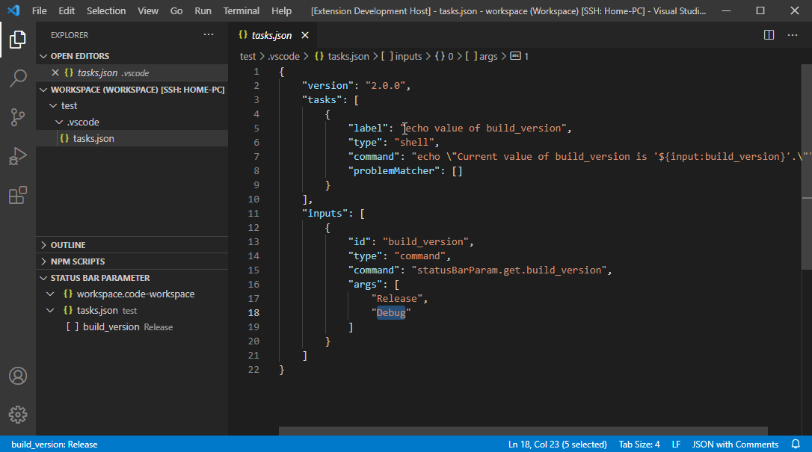

# Status Bar Parameter

This vscode extension adds selectable parameter to the status bar (in the bottom), which can be used in the following vscode configuration files:
* tasks.json
* launch.json
* *.code-workspace

Click to show how to add a parameter.

Click to show how to retrieve the selected value.

## Additional Features
* Pick `Command` type when adding a parameter to parse the selectable parameters dynamically from a shell command.
* Edit/Delete the entry at the input section of the configuration file to adjust/remove the parameter.
* Add `"canPickMany": true` to the `args` object of any status bar parameter to enable multiple selection.
* Use the string `${command:statusBarParam.get.<param_name>}` (instead of `${input:<param_name>}`) to retrieve the selected value of a parameter from any other vscode configuration file than the one it is defined in.